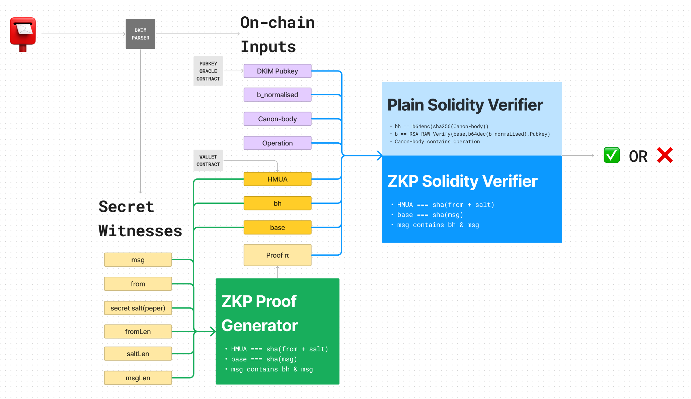

# Crescent DKIM
Crescent DKIM system is designed for verifying on-chain ownership by email's DKIM with privacy.
This repo is a tutorial and example for DKIM ZKP system, separated from Crescent main client and contract repo.

# Setup
- `make init` to install dependencies.
- `make prove` to compile the circuit, run tests and generate witnesses. If there exist compiled circuit files in `build_circuits` folder, it will skip compilation.
- `make clean` to remove all files in `build_circuits`.

**Notice**
You should install circom and snarkjs to run this project. Circom 2.0.6 is required for this project. If you’re using a higher version, it could lead to errors in test JS files as current snarkjs and higher circom compiler are incompatible in some functions.

# Overview
In this solution, we divide parameters and verifiers as below:

## Security Concerns
Imagine an attacker tries to manipulate or forge proofs and other inputs to break the DKIM system. 

Firstly we define three classes of inputs:
* **True input**: The input was generated by the owner’s email directly.
* **False input**: The input was wrong in every aspect. 
* **Pseudo-True input pair**: The input pair was forged by the attacker. It’s not from the real owner but mathematically or cryptographically correct. Eg., base and msg are both inputs while msg is a secret witness,`base = sha256(msg)`, the attacker forged a fake msg and calculated its corresponding base.

As you can see we have several major conditions to be fulfilled. Anyone of them fails will lead to rejection.

If an attacker wants to use pseudo-true canon-body and bh with all the other true parameters. He will be rejected by `bh ∈ msg` limitation.

You can try and think in an attacker’s way to examine the constraints or limitations you set. Crescent’s design is just in beta phase so it should not be utilised without DYOR. If you find any security breach, it’s our pleasure to receive your report :) .

# Off-chain Parser
The off-chain parser will provide the following parameters:
- **b_normalised**: The signature(b) that removes /r/n/t.
- **canon-body**: Canonicalised body content.
- **Operation**: Operations specified in body.
- **bh**: Body hash.
- **base**: The base of RSA exponentiation. I.e., the hash of the message to be signed, `base = sha(msg)`.
- **msg**: Combination of some header fields. The message to be signed.
- **from**: User’s email address.
- **salt**: Secret salt, aka pepper, is used to hide the email address in HMUA. `HMUA = sha(from + pepper)`.
- **fromLen, saltLen, msgLen**: Length of corresponding strings. Used to specify the offsets in circuits.

There are various tools or projects that can analyse and verify DKIM signatures. We use [dkimpy](https://pypi.org/project/dkimpy/) here.

Example of input generation see `scripttest/dkim.js`.

# Turn ZKP Circuits to ZKP Solidity Verifier
Finish the keygen ceremony before turn the circuits into solidity verifier. `contracts/verifier.sol` is just an example of the final output.

## MPC Keygen Ceremony Phase1 & Phase2
For Phase1, you can download the existing `.ptau` file generated by famous parties instead of generating it yourself. Phase2 is circuit-specific key generation. If you’re using Plonk instead of Groth16, ignore Phase2.

Just read[GitHub - iden3/snarkjs: zkSNARK implementation in JavaScript & WASM](https://github.com/iden3/snarkjs).
**Notice:** You should run `snarkjs r1cs info circuit.r1cs` and check `maxConstraints` before you generate/download Phase1 keys and select a proper power according to the table in the above link.

# References
- [GitHub - noway/sha256-var-circom: Variable length sha256 hash function in Circom](https://github.com/noway/sha256-var-circom)
- [GitHub - adria0/SolRsaVerify: Solidity RSA Sha256 Pkcs1 Verification](https://github.com/adria0/SolRsaVerify)
- [RFC6376](https://www.rfc-editor.org/rfc/rfc6376)
- [RFC6234](https://www.rfc-editor.org/rfc/rfc6234)

